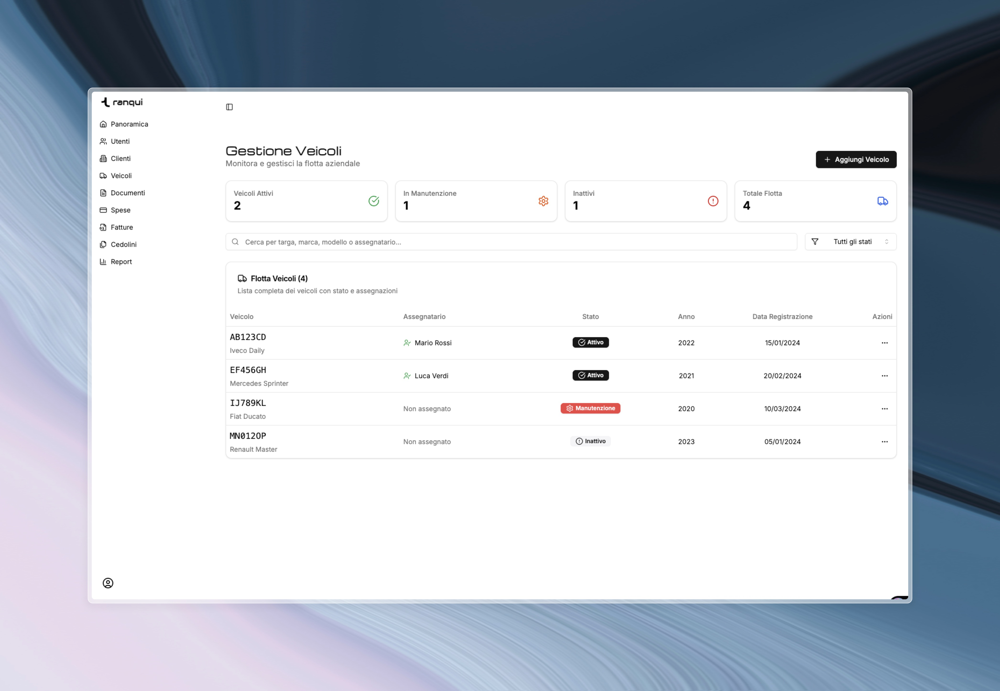

    <a href="https://ideclare-landingpage.vercel.app/"><h1 align="center">Tranqui</h1></a>

 

    
    
    
    
    

## ✋ What is Tranqui?

Tranqui is a multi-tenant SaaS for transport and logistics companies to manage operations, expenses, documents, and finances.

## 🚚  What We Do

Tranqui is a comprehensive CRM platform designed for transport and logistics companies. We automate administrative tasks, reduce manual data entry, and provide real-time insights into fleet operations, expenses, and financials.

**Key Features:**

- 🚗 Vehicle & Fleet Management
- 📄 Document Management with OCR
- 💰 Expense Tracking & Categorization
- 🧾 Invoice Management (Issued & Received)
- 👥 Payroll Processing (Cedolini)
- 📊 Analytics & Reporting

---

**Built with ❤️ by lucas for the transport and logistics industry**
